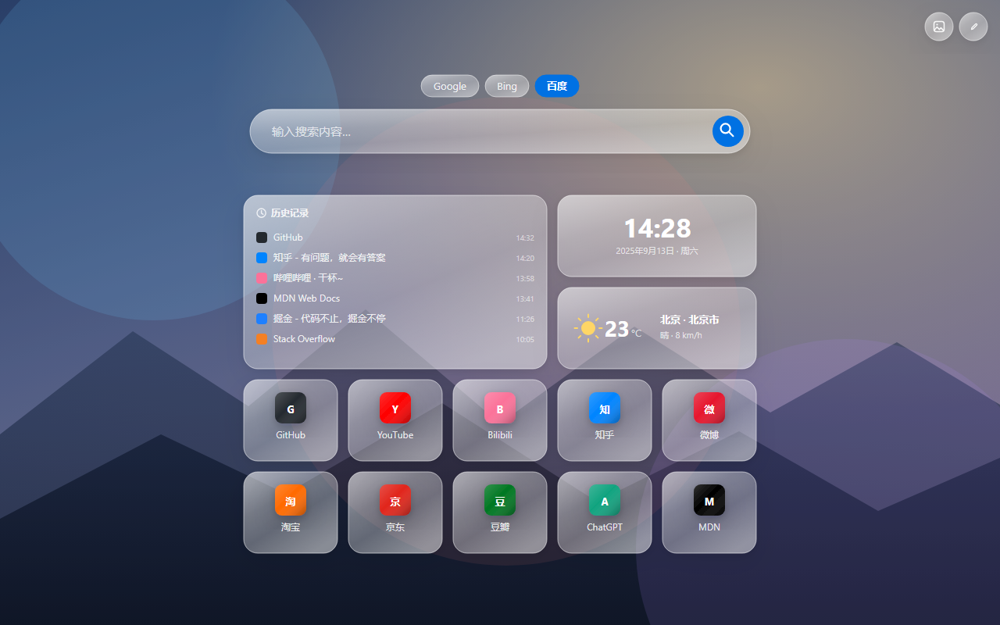
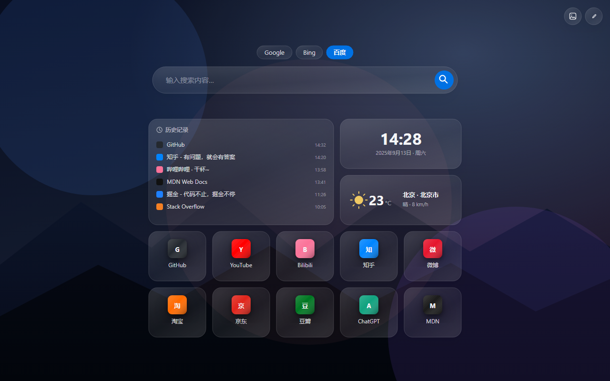

<div align="center">


# 简练首页

**液态玻璃风格的新标签页** —— 搜索 · 快捷网址 · 历史记录 · 时钟 · 天气

原生 ES Module，无构建步骤，Widget 架构可自由扩展


</div>

---

## 效果预览

| 浅色（跟随系统亮色） | 暗色（跟随系统暗色） |
|:---:|:---:|
| [](docs/preview.png) | [](docs/preview-dark.png) |

> 上图为界面示意图。实际效果包含**鼠标跟随的玻璃光斑**、**悬停时的 3D 倾斜**、**缓慢漂浮的背景光晕**、**卡片图标的就地淡入**等动态细节，截图无法完整呈现 —— 建议直接装上体验。

---

## 功能

### 🔍 搜索
- Google / Bing / 百度 一键切换（记住上次选择）
- 搜索框也有玻璃光斑跟随效果
- 回车即搜索，输入框自动聚焦

### 🔖 快捷网址
- **图标自动获取**：按 `/apple-touch-icon.png` → `/favicon-32x32.png` → `/favicon.ico` → 品牌色字母 依次回退
- **智能缓存**：抓取成功（或你手动填了图标）→ 永久记住，下次秒开；抓取失败 → 下次自动重试
- 可自定义名称、网址、图标地址、品牌色、卡片尺寸（1×1 / 2×1）
- 编辑模式下拖拽排序

### 🧩 内置小组件
| 组件 | 说明 |
|------|------|
| **历史记录** | 读取浏览器最近访问，3×2 大卡片 |
| **时钟** | 12/24 小时制可选，与屏幕刷新同步走时 |
| **天气** | 📍自动定位 或 ✍️手动城市；温度、天气、风速；点击卡片刷新；20 分钟缓存 |

### ✨ 液态玻璃视觉
- 多层向内阴影 + 边缘反光模拟玻璃厚度
- 卡片内部光斑**跟随鼠标移动**（`--mx/--my`）
- 悬停时轻微 **3D 倾斜**（真实透视，弹簧缓动）
- 背景三个缓慢漂浮的彩色光晕
- 整体跟随系统**自动切换暗色模式**

### 🎛 交互细节
- **删除可撤销**：删卡片后 6 秒内可一键找回（插回原位置）
- **Esc 逐层退出**：编辑弹窗 → 背景弹窗 → 退出编辑模式
- **键盘可用**：Tab 聚焦有清晰焦点环，弹窗内焦点循环、关闭后焦点归位

### 🔐 数据可靠
- 配置存本机为主（`storage.local`，5MB），云端镜像用于跨设备同步
- 云端配额不足时**自动降级**为仅本地保存并提示，绝不丢数据
- 不含任何统计、埋点、远程服务器

---

## 安装

### 1. 获取代码

```bash
git clone <本仓库地址>   # 或点右上角 Code → Download ZIP 后解压
```

> 记住解压后的文件夹路径，下一步要用。

### 2. 加载到浏览器

**Chrome**

1. 地址栏输入 `chrome://extensions` 回车
2. 打开右上角的 **开发者模式**
3. 点左上角 **加载已解压的扩展程序**
4. 选择**包含 `manifest.json` 的那个文件夹**（不是它的上级目录）
5. 打开新标签页即可看到效果 ✅

**Edge**

1. 地址栏输入 `edge://extensions` 回车
2. 打开左下角的 **开发人员模式**
3. 点 **加载解压缩的扩展** → 选择同一文件夹（`manifest.json` 所在目录）

> ⚠️ 浏览器同一时间只能有**一个扩展**接管新标签页。如果装了多个新标签页类扩展，需要在扩展管理页停用其他几个。

### 3. 完成后的建议操作

| 操作 | 说明 |
|------|------|
| 打开新标签页 | 默认布局：历史记录 + 时钟 + 天气 + 12 个常用网址 |
| 授权定位（可选） | 天气卡首次加载会请求位置权限；拒绝也没关系，可改手动城市 |
| 点右上角铅笔图标 | 进入编辑模式：增删卡片、拖拽排序、调整尺寸 |

### 4. 更新扩展

修改代码（或 `git pull`）后：

1. 回到 `chrome://extensions` / `edge://extensions`
2. 点该扩展卡片上的 **⟳ 刷新** 按钮
3. 已打开的新标签页会**自动重载**到新版本（v2.2.1+），无需手动 F5

### 卸载

扩展管理页中点 **移除** 即可。若想彻底清除数据，卸载时勾选清除数据（或手动删除扩展的本地存储）。

---

## 使用说明

### 快捷键

| 按键 | 作用 |
|------|------|
| `Enter` | 搜索 |
| `Tab` / `Shift+Tab` | 在按钮、卡片、输入框之间移动焦点 |
| `Esc` | 关闭编辑弹窗 → 关闭背景弹窗 → 退出编辑模式（逐层） |
| `Enter` / `Space` | 激活当前聚焦的按钮 |
| 编辑模式下拖拽卡片 | 调整顺序 |
| 点击天气卡片 | 立即刷新（重新定位 + 拉取） |

### 编辑模式

点右上角 **铅笔图标** 进入（再点一次或按 `Esc` 退出）：

- 每张卡片左上角出现 **✎ 编辑**、右上角出现 **✕ 删除**
- 出现 **+ 添加** 卡片，可选择组件类型并填写配置
- 卡片可 **拖拽排序**
- 网址卡片可拖 **右下角手柄** 在 1×1 / 2×1 之间切换

### 天气组件设置

编辑天气卡片后可配置：

| 项目 | 说明 |
|------|------|
| **位置** | `📍 自动定位`（默认，用浏览器定位）/ `✍️ 手动城市`（输入城市名，如「北京」「Tokyo」） |
| **城市** | 仅手动模式显示，支持中英文 |
| **温度单位** | °C / °F |

定位失败时：若之前配置过城市，会自动降级用城市查询；否则显示「定位失败 · 点击重试」。

数据来源：[Open-Meteo](https://open-meteo.com/)（免费、无需 API Key）+ BigDataCloud 反查城市名。

---

## 自定义与扩展

| 想改什么 | 改哪里 |
|----------|--------|
| 默认网址、背景图、调色板 | `js/presets.js` |
| 新搜索引擎 | `js/core.js` 里的 `Engines` 对象 |
| 玻璃质感、动效强度 | `newtab.html` 顶部的 `:root` CSS 变量 |
| **加一个全新组件** | 看 [`EXTENDING.md`](EXTENDING.md)，30 行代码即可 |

**加组件的核心思路**：卡片外壳（玻璃外观、拖拽、缩放、编辑删除按钮、光效）全部由核心统一处理，你只需要实现「卡片里画什么」：

```js
// js/widgets/hello.js
import { Widgets, el } from '../core.js';

Widgets.register({
  id: 'hello',
  name: '打招呼',
  defaults: { w: 1, h: 1 },
  match: e => e.type === 'hello',
  createEntry: () => ({ type: 'hello', name: '你好' }),
  render(body, entry, ctx) {
    body.appendChild(el('div', '', { text: '👋 ' + (entry.name || '你好') }));
  },
  editorFields: [{ key: 'name', label: '文字', type: 'text', default: '你好' }],
});
```

在 `newtab.js` 里 `import './js/widgets/hello.js'`，刷新扩展 —— 新组件自动出现在「添加」菜单里，并且**自动继承整套液态玻璃外观**。

---

## 数据、权限与隐私

### 数据存在哪

| 内容 | 位置 | 说明 |
|------|------|------|
| 卡片布局、背景、开关 | `chrome.storage.local` 的 `data` 数据包 | **主存储**，5MB，可靠 |
| 同上（镜像） | `chrome.storage.sync` | 仅用于跨设备同步；超过 7.5KB 自动跳过并提示，不影响本地 |
| 网站图标缓存 | `chrome.storage.local`（`icon:` 前缀） | 按域名缓存，抓成功的才存 |
| 天气数据缓存 | `chrome.storage.local`（`weather:` 前缀） | 20 分钟有效 |

多设备同时使用时按修改时间取最新的一份（last-write-wins）。

### 权限用途

| 权限 | 为什么需要 |
|------|-----------|
| `storage` | 保存你的卡片布局与缓存 |
| `history` | 渲染「历史记录」小组件（只读，不外传） |
| `geolocation` | 天气自动定位（**可在 `manifest.json` 删掉此权限**，改用手动城市） |

| 域名访问 | 为什么需要 |
|----------|-----------|
| `api.open-meteo.com`、`geocoding-api.open-meteo.com` | 天气数据 / 城市名→经纬度 |
| `api.bigdatacloud.net` | 经纬度→城市名（反查，仅自动定位时用） |

**隐私**：所有数据只存在你的浏览器里，没有账号体系、没有统计上报、没有自建服务器。唯一的对外请求是天气数据（只发送经纬度或城市名）。

---

## 项目结构

```
.
├── manifest.json          # MV3 清单：权限、图标、新标签页覆盖
├── newtab.html            # 页面骨架 + 全部液态玻璃 CSS
├── newtab.js              # 入口：import 各组件 + 启动
├── EXTENDING.md           # ★ 组件开发指南（含完整示例）
├── LICENSE                # MIT
├── icons/                 # 扩展图标 16 / 32 / 48 / 128
├── tools/
│   └── make-icons.mjs     # 图标生成脚本（自动裁切主体 + 缩放）
├── docs/
│   ├── preview.png        # 效果示意图（浅色，1280×800）
│   ├── preview-dark.png   # 效果示意图（暗色）
│   └── preview*.svg       # 同上，矢量源文件（可缩放、可改配色）
└── js/
    ├── core.js            # 核心：存储 / 数据包 / 渲染引擎 / 弹窗 / 光效
    ├── presets.js         # 默认网址、预设背景、调色板
    └── widgets/
        ├── shortcut.js    # 网址卡片（图标回退链 + 缓存）
        ├── history.js     # 历史记录
        ├── clock.js       # 时钟
        └── weather.js     # 天气（定位 / 手动城市）
```

**架构一句话**：`core.js` 提供外壳与基础设施，`widgets/*.js` 只负责卡片内部内容，`presets.js` 放可自由修改的预设数据。

---

## 常见问题

<details>
<summary><b>图标不显示 / 只显示一个彩色字母？</b></summary>

目标站点没有可用的 favicon（或被 CSP、防盗链挡住），此时回退为品牌色字母底 —— 属于正常表现。

补救方式：
1. 编辑该卡片，在「图标」里粘贴一个图片直链或 `data:image/...`
2. 抓取失败的域名**下次打开新标签页会自动重试**（不会被永久记住）
</details>

<details>
<summary><b>天气显示「定位失败 · 点击重试」？</b></summary>

浏览器定位被拒绝或超时。点卡片可重试；或编辑卡片切换为**手动城市**模式（推荐在桌面端这样用）。

若不想授予定位权限，可以编辑 `manifest.json` 的 `permissions`，删掉 `"geolocation"`。
</details>

<details>
<summary><b>卡片数据会不会丢？</b></summary>

不会。v2.2.0 起配置以本机 `storage.local` 为主存储（5MB），彻底避开了 `chrome.storage.sync` 单 key 8KB 的写入上限。

云端同步在配置过大时会自动暂停（页面上有提示），但**本地保存始终正常**。
</details>

<details>
<summary><b>刷新扩展后新标签页报错或行为异常？</b></summary>

扩展被刷新/更新后，已打开的旧页面会变成「僵尸页面」（API 全部失效）。v2.2.1 起会自动检测并**提示 + 自动重载**，无需手动操作。
</details>

<details>
<summary><b>怎么备份或迁移到另一台电脑？</b></summary>

目前可复制浏览器扩展数据目录（或依赖 `chrome.storage.sync` 的跨设备同步）。「导出 / 导入 JSON」在开发计划中。
</details>

<details>
<summary><b>支持 Firefox 吗？</b></summary>

当前只针对 Chromium 内核（Chrome / Edge）。Firefox 需要把 `chrome.*` 换成 `browser.*` 并调整 manifest 细节，欢迎做成兼容分支。
</details>

---

## 开发

- **无构建步骤**：原生 ES Module，改完代码直接刷新扩展即可生效
- **调试**：在新标签页按 `F12`，Console 里会输出存储、迁移、图标抓取等日志
- **重新生成图标**（换一张源图时）：
  ```bash
  node tools/make-icons.mjs 源图.png                                  # 自动识别主体并裁成正方形，输出到 icons/
  node tools/make-icons.mjs 源图.png icons --box=269,446,1007,1054     # 也可手动指定图标区域
  ```
- **测试**：仓库使用 Node 脚本做无浏览器冒烟测试（模拟 `chrome.*` API 与 DOM），可自行运行验证核心逻辑

### 版本历史

| 版本 | 主要变化 |
|------|---------|
| **2.2.3** | 新增扩展图标（16/32/48/128）与图标生成脚本；以 MIT 许可证开源 |
| **2.2.2** | 记住搜索引擎选择；补充 README 与效果示意图 |
| **2.2.1** | 扩展刷新后自动重载（修复 `Extension context invalidated` 误报） |
| **2.2.0** | 存储架构升级：数据包 + 本地主存储 + 云端镜像，根治 8KB 上限丢数据 |
| **2.1.0** | 新增天气组件（自动定位）、修复时钟不走时、图标缓存策略与重叠修复 |
| **2.0.0** | 重构为 ES Module + Widget 注册中心架构，液态玻璃视觉强化 |

---

## 许可

本项目基于 [MIT 许可证](LICENSE) 开源，可自由使用、修改、分发（包括商用），保留版权声明即可。
